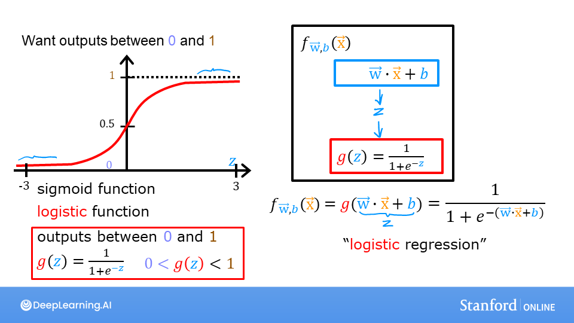
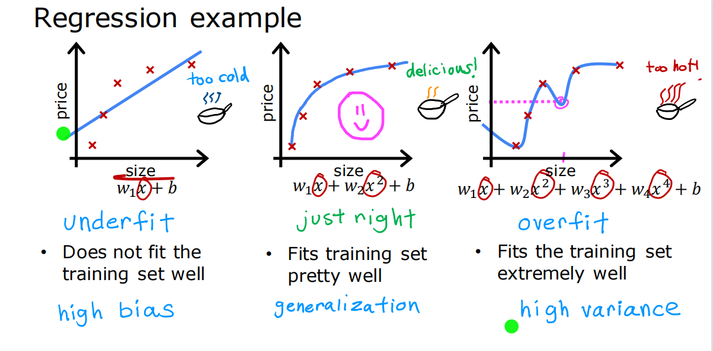
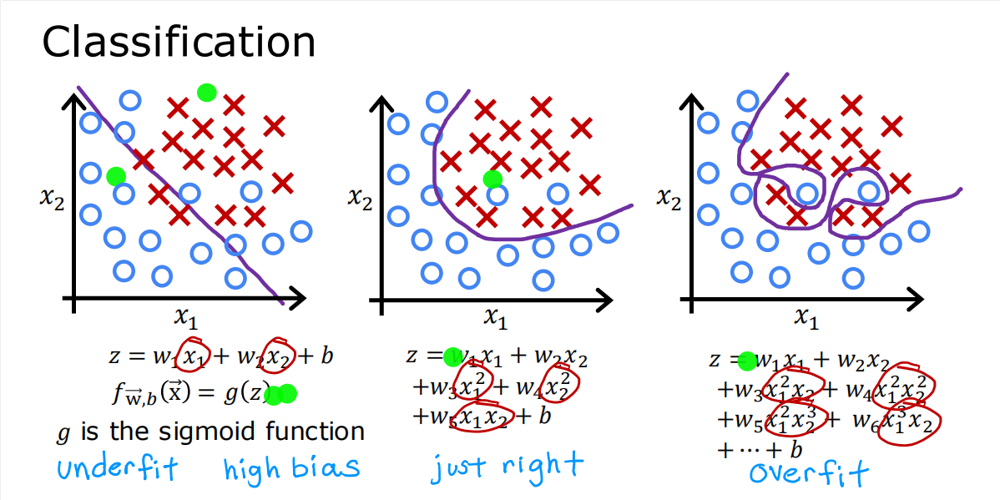

# 吴恩达机器学习第一部分

---

## 机器学习的介绍

- 定义：一种不需要明确编程就能让计算机学习的研究领域
- 分类：监督学习和无监督学习

### 监督学习介绍

监督学习通过已知的例子学习输入到输出的映射，从而对新的输入进行输出的预测。监督学习的两种主要类型是回归和分类，其中回归的输出有无限种可能取值，而分类的输出只有固定的可能取值。

### 无监督学习介绍

无监督学习的数据只有输入，让机器自己发掘数据之间的联系及规律。无监督学习的主要类型有聚类、异常检测和降维。

----

## 线性回归模型

### 单元线性回归

单元线性回归的映射函数为:

$$f_{w,b}(x) = wx + b$$

其中w和b为参数，为了确定和已知数据拟合程度最好的参数w和b，需要先定义代价函数，使用均方差的代价函数为：

$$J(w,b) = \frac{1}{2m} \sum\limits_{i = 0}^{m-1} (f_{w,b}(x^{(i)}) - y^{(i)})^2$$

梯度下降法可以通过迭代逐步使得代价函数最小化：

$$\begin{align*} \text{repeat}&\text{ until convergence:}  \lbrace \newline  
& w = w -  \alpha \frac{\partial J(w,b)}{\partial w} \tag{1} \newline &
b = b -  \alpha \frac{\partial J(w,b)}{\partial b}  \newline & \rbrace\end{align*}$$ 

$$\frac{\partial J(w,b)}{\partial b}  = \frac{1}{m} \sum\limits_{i = 0}^{m-1} (f_{w,b}(x^{(i)}) - y^{(i)}) \tag{2}$$

$$\frac{\partial J(w,b)}{\partial w}  = \frac{1}{m} \sum\limits_{i = 0}^{m-1} (f_{w,b}(x^{(i)}) -y^{(i)})x^{(i)} \tag{3}$$

其中, $\alpha$ 代表学习率，通常取一个小的正数，如0.01，若过小则收敛太慢，若过大则不会收敛，可能反而使得代价函数不断增大，所以在具体使用时要不断调整 $\alpha$ 来得到最适合的值。

若选取得当，则在一定次数的迭代后代价函数趋于最小（局部最小），此时的w和b即为确定的参数值，带入后可以对新的输入进行输出预测。

### 多元线性回归

多元线性回归的映射函数为:

$$ f_{\mathbf{w},b}(\mathbf{x}) =  w_0x_0 + w_1x_1 +... + w_{n-1}x_{n-1} + b$$

使用向量化则表示为：

$$ f_{\mathbf{w},b}(\mathbf{x}) = \mathbf{w} \cdot \mathbf{x} + b$$ 

其中w和x均为向量， $\cdot$ 表示向量点乘，向量化简洁且高效，因为可以用NumPy库的函数使得硬件并行计算从而加速运行。 

均方差代价函数表示为：

$$J(\mathbf{w},b) = \frac{1}{2m} \sum\limits_{i = 0}^{m-1} (f_{\mathbf{w},b}(\mathbf{x}^{(i)}) - y^{(i)})^2 $$

对应的梯度下降算法为：

$$\begin{align*} \text{repeat}&\text{ until convergence:}  \lbrace \newline
& w_j = w_j -  \alpha \frac{\partial J(\mathbf{w},b)}{\partial w_j} \tag{1}  & \text{for j = 0..n-1}\newline &b\ \ = b -  \alpha \frac{\partial J(\mathbf{w},b)}{\partial b}  \newline \rbrace \end{align*}$$

$$\begin{align}\frac{\partial J(\mathbf{w},b)}{\partial w_j}  &= \frac{1}{m} \sum\limits_{i = 0}^{m-1} (f_{\mathbf{w},b}(\mathbf{x}^{(i)}) - y^{(i)})x_{j}^{(i)} \tag{2}  \\
\frac{\partial J(\mathbf{w},b)}{\partial b}  &= \frac{1}{m} \sum\limits_{i = 0}^{m-1} (f_{\mathbf{w},b}(\mathbf{x}^{(i)}) - y^{(i)}) \tag{3} \end{align}$$

#### 特征放缩

对于多元回归，不同变量的可能取值范围往往相差较大，有的范围很大有的范围很小，不利于梯度下降确定参数值，所以需要对训练数据进行转换处理，即特征放缩（或称归一化），例如均值归一化：

$$x_i := \dfrac{x_i - \mu_i}{max - min}$$

Z-Score归一化为：

$$x^{(i)}_j = \dfrac{x^{(i)}_j - \mu_j}{\sigma_j}$$

其中 $\mu$ 为均值， $\sigma$ 为标准差。

---

## 逻辑回归模型

对于分类问题，线性回归效果并不好，需要引入逻辑回归算法。以下考虑二分类问题，即输出只有两种可能（可表示为0和1）。线性回归的输出范围无穷，通过Sigmoid函数（也称逻辑函数）将其输出映射到0到1的范围内，就得到了二分类逻辑回归函数：

逻辑回归函数的输出值可看作是类别为1的概率，例如输出值0.7代表有70%的概率认为该数据属于分类1。另外，当输出值为0.5时，z等于0，称为决策边界，大于边界预测为1，反之预测为0。

均方差代价函数并不是逻辑回归的理想代价函数，因为其不再是凹函数，不能用梯度下降法，如下图：

适合逻辑回归的损失函数如下，该公式运用了极大似然估计思想：

$$loss(f_{\mathbf{w},b}(\mathbf{x}^{(i)}), y^{(i)}) = \begin{cases}- \log\left(f_{\mathbf{w},b}\left( \mathbf{x}^{(i)} \right) \right) & \text{if $y^{(i)}=1$}\\- \log \left( 1 - f_{\mathbf{w},b}\left( \mathbf{x}^{(i)} \right) \right) & \text{if $y^{(i)}=0$}\end{cases}$$

或者简写为：

$$loss(f_{\mathbf{w},b}(\mathbf{x}^{(i)}), y^{(i)}) = (-y^{(i)} \log\left(f_{\mathbf{w},b}\left( \mathbf{x}^{(i)} \right) \right) - \left( 1 - y^{(i)}\right) \log \left( 1 - f_{\mathbf{w},b}\left( \mathbf{x}^{(i)} \right) \right)$$

以上loss函数（损失函数）衡量的是单个样本预测值和实际值的差异，cost函数（代价函数）J 等于所有样本损失的均值，衡量的是整个数据集预测值和实际值的差异：

$$J(\mathbf{w},b) = \frac{1}{m} \sum_{i=0}^{m-1} \left[ loss(f_{\mathbf{w},b}(\mathbf{x}^{(i)}), y^{(i)}) \right]$$

为了求得最小的代价函数，仍然需要使用梯度下降法：

$$\begin{align*} \text{repeat}&\text{ until convergence:}  \lbrace \newline 
& w_j = w_j -  \alpha \frac{\partial J(\mathbf{w},b)}{\partial w_j} \tag{1}  & \text{for j = 0..n-1}\newline
&b\ \ = b -  \alpha \frac{\partial J(\mathbf{w},b)}{\partial b}  \newline \rbrace\end{align*}$$

$$\begin{align}\frac{\partial J(\mathbf{w},b)}{\partial w_j}  &= \frac{1}{m} \sum\limits_{i = 0}^{m-1} (f_{\mathbf{w},b}(\mathbf{x}^{(i)}) - y^{(i)})x_{j}^{(i)} \tag{2}  \\
\frac{\partial J(\mathbf{w},b)}{\partial b}  &= \frac{1}{m} \sum\limits_{i = 0}^{m-1} (f_{\mathbf{w},b}(\mathbf{x}^{(i)}) - y^{(i)}) \tag{3} \end{align}$$

虽然公式与线性回归的梯度下降相同，但 $f_{\mathbf{w},b}(\mathbf{x})$ 的定义不同，如下图：

---

## 过拟合及解决方法

欠拟合是指模型对训练数据的拟合不足，即有高偏差（high bias）；而过拟合是指模型能很好拟合训练数据，但不具有推广性，泛化能力很差，即有高方差（high variance），如果训练数据稍有变化拟合函数就可能完全不同，如图：

过拟合有以下三种解决方法：
- 增加训练数据量
- 特征选择，即剔除一些不需要的项
- 正则化，特征选择的改进版

### 正则化

正则化的思想是尽量降低各项特征前的参数值w，防止某项的权重过大，从而拟合出更平滑、更简单、更不容易过拟合的函数。以下是加入正则化处理的线性回归和逻辑回归：

可见，改进之处在于代价函数新加了一项从而变成了两部分，前一部分衡量预测值与实际值的差异，后一部分衡量参数w的大小，这样梯度下降不断降低代价函数的过程就既能拟合数据，又降低了过拟合的风险。其中 $\lambda$ 的值代表了后一部分的权重，若等于0则没有正则化导致过拟合，若取值很大则得出一条水平直线即欠拟合，所以需要不断调整找出 $\lambda$ 的合适取值来平衡前后两项。