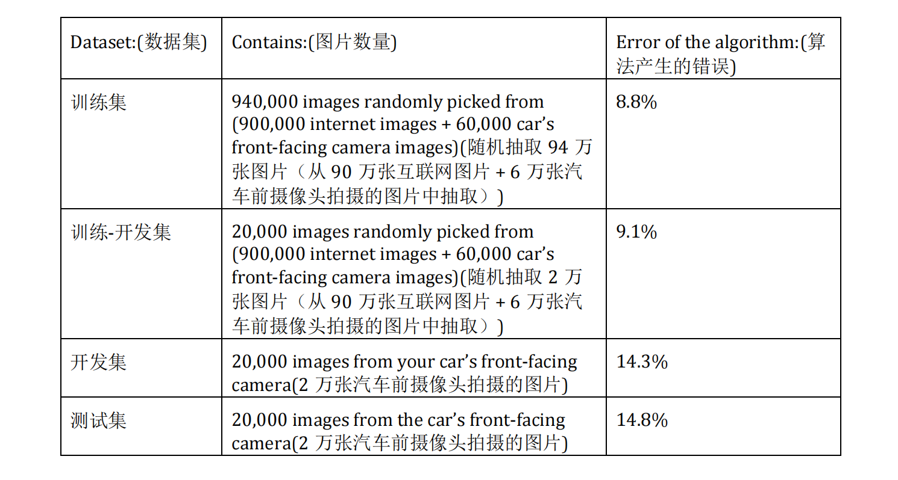
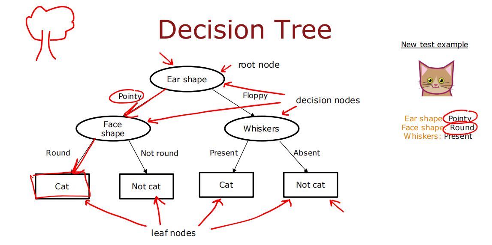

# 吴恩达机器学习第二部分

---

## 神经网络

### 导入

相关概念：神经元、激活函数、输入层、隐藏层、输出层

下图是用TensorFlow构建的一个小型神经网络，用来预测咖啡豆烘培效果的好坏，该神经网络共两层，包括一个隐藏层和输出层，隐藏层有三个神经元，选用sigmoid函数作为激活函数，输入值有两个，分别表示温度和时间：

### 训练过程

如上图，训练一个神经网络大致分三步：

1. 构建模型：设置层数、神经元数、激活函数以及初始参数值
2. 代价函数：指定要使用的损失函数及代价函数
3. 梯度下降：通过反向传播来修改各层的参数值，不断迭代使得代价函数趋于最小，从而获得拟合程度最好的模型 

#### 补充

若不使用框架而是手动实现神经网络，则需要完成的步骤有参数初始化、前向传播、计算误差、反向传播与更新参数。

##### 参数初始化

在参数初始化阶段，可以完全采用随机值，但有可能随机产生的值较大，使得梯度下降效果不好，所以一般在生成的值后面乘上一个小数，例如0.01，或者是根据本层输入个数所产生的动态值：

##### 反向传播

前向传播的过程中每层保存其中间计算值作为cache为反向传播做准备，反向传播的主要数学原理是复合函数的链式求导法则，逐步计算出每层参数的导数值，再用原值减去学习率与导数值的积，从而完成梯度下降。以含一个隐藏层的二元分类网络（输出层激活函数为逻辑函数）为例说明前向传播与反向传播的计算公式：

##### 梯度检验

梯度检验是一种辅助手段，用来验证反向传播过程中计算的各参数的导数值是否正确，原理就是用双侧差值来逼近斜率，计算：

看这个值与反向传播计算的值是否足够接近（一般在 $10^{-7}$ 左右）从而判断反向传播是否存在问题。

##### 小批量梯度下降

普通的梯度下降称为批量梯度下降（Batch Gradient Descent），每次计算梯度时需要用到所用的训练数据，当数据量很大时运算速度较慢。有另一种叫随机梯度下降（Stochastic Gradient Descent）的方式，其每次只计算一个训练实例的梯度，相当于不仅要对迭代次数进行循环，还要对m个训练数据进行循环，其参数更新很频繁，优点在于单次计算量小，缺点在于可能产生震荡，而且不能用到向量化并行计算，两种方式对比图如下：

小批量梯度下降（Mini-Batch Gradient Descent）就是二者的结合，该种方式首先对迭代次数进行循环，然后对训练数据的小批次进行循环，每个批次包含若干条数据，通常取2的幂，如16，32，64，128等，若选取合适的批次大小，则该方法的效果比上述两种都要好。

##### Adam算法

Adam算法也是对普通梯度下降的一种优化，可以减少震荡并加快训练速度，往往和小批量梯度下降结合使用。介绍Adam算法之前需要先了解几个概念，首先是指数加权平均，其核心公式为：

$$v_t = \beta v_{t-1} + (1 - \beta) \theta_t$$

其中 $\beta$ 是一个接近1的小数，例如0.9，该公式的含义是不直接取每一个新计算出的值 $\theta_t$ ，而是取这个值和其以前值的混合，这样能避免变化过于剧烈，$v_t$ 从而代表了 $\dfrac{1}{1-\beta}$ 次的平均值。在使用时，往往取 $v_0 = 0$ ，然后依次向后计算，这样会使前几个值与实际值相差较大，可以采取以下修正方式：

$$v_t = \dfrac{v_t}{1-\beta^t}$$

可见，修正主要使前几个值变大，当 $t$ 很大时几乎不会有影响。

动量梯度下降（momentum）就是将这种指数加权平均用在了梯度下降上：

还有一种叫RMSprop的算法，全称均方根传递，和动量梯度下降类似，也可以加快学习速度，实现如下：

而Adam算法（自适应矩估计算法）就是momentum和RMSprop的结合，它计算过去梯度的指数加权平均值，并且存储在变量 $v$ （未进行偏差修正）和变量 $v^{corrected}$ （进行了偏差修正）中，它还计算过去梯度平方的指数加权平均值，并且存储在变量 $s$ （未进行偏差修正）和变量 $s^{corrected}$ （进行了偏差修正）中，根据两部分的组合信息，在一个确定的方向更新参数：

### 激活函数

上图为三种常用的激活函数，分别为线性函数、逻辑函数和ReLU函数。在实际使用时需根据具体情况来设置不同神经元的激活函数，一般来说只需重点关注输出类型，对于二分类问题，输出层使用Sigmoid函数，其余情况看输出值是否可能为负数来选择线性函数或ReLU函数。隐藏层大多数情况下均使用ReLU激活函数，因为相比于Sigmoid函数，ReLU函数的梯度下降更高效，而相比于线性函数，ReLU函数将负值归零能使得模型将线段拼接在一起，以模拟复杂的非线性函数。

### 多分类问题

#### Softmax回归

Softmax用于神经网络可以解决多分类问题，其定义如下：

相应的损失函数和代价函数如下图：

#### 具体实现

以手写数字识别为例，构建三层神经网络，其中输出层有十个神经元，分别代表数字0到9的概率，使用TensorFlow的代码如下：

其中两个隐藏层均使用ReLu激活函数，输出层使用Softmax激活函数，在compile中指定损失函数为SparseCategorialCrossentropy（稀疏分类交叉熵）

为了计算更加准确，采用如下优化版本：

该方式将输出层换为线性激活，在损失函数处附加参数 "from_logits = True" 从而将Softmax的功能包含在了损失计算中，同样可以完成多分类任务，但要注意此时输出值不再是概率，如需获得各部分的概率则需对输出值再多加一步Softmax处理。

### 模型评估

#### 数据划分

为了筛选参数及评估效果，往往将已有数据划分为训练集、交叉验证集和测试集三部分，具体功能如下：

- 训练集：用于在训练或拟合中确定适合的w和b参数
- 交叉验证集：也叫开发集，通过对比来确定模型的其他参数（也称为超参数），如多项式次数、正则化参数和神经网络的结构
- 测试集：在确定最终模型后评估其效果，要确保其数据和开发集来自相同分布

以下图为例，假设为解决某个问题构建了三个可能的神经网络，将数据按6：2：2的比例划分，在训练集代价值大致相同的情况下，第二个网络的交叉验证集代价值最低，表明该网络泛化性能最好，所以选择该网络并最终用测试集来评估效果。

另外，在深度学习时代，数据量往往很大，此时可能只需要1%的数据来给开发集与测试集就可以。在实际应用中，可能训练集数据和开发/测试集数据来自不同分布，产生数据不匹配问题，此时再从训练集中单独分离一小部分作为训练-开发集，其指标和开发集指标的差异大小来判断数据失配的程度，如果数据失配比较严重，就要考虑做一些人工处理来让训练集数据类型尽量向开发/测试集靠拢，如下图：

#### 偏差方差

模型对数据的偏差（bias）和方差（variance）是很重要的衡量指标和决策依据，一般来说高偏差意味着欠拟合，高方差意味着过拟合，具体判断需要看训练集和交叉验证集上的代价值，如下：

为了判断 $J_{train}$ 与 $J_{cv}$ 的高低程度，需要一个基线，这个基线可以设置为人类在该任务上的表现水平，或者是之前已有算法的表现水平，通过 $J_{train}$ 与 $J_{cv}$ 和基线对比来确定是否存在高偏差或高方差。

#### 学习曲线
学习曲线是指 $J_{train}$ 与 $J_{cv}$ 随训练数据量的变化趋势，可以用来辅助判断高偏差与高方差：

可见，增加数据量对于高偏差效果不大，但可以改善高方差。

#### 精度与召回率

精度（precision）和召回率（recall）也是重要的评价指标，尤其适用于数据倾斜（即样本比例悬殊，正负标签远不是五五开）的情况，定义如下：

总而言之，精度是衡量是否“找的对”，召回率是衡量是否“找的全”。在实际中，二者存在权衡，可通过改变决策阈值来使其符合需求。此外还有另一个指标叫F1评分（F1 score），它可以自动结合精度和召回率来帮助选择最佳平衡值，其定义为二者的调和平均值：

### 神经网络正则化

如上图，对于神经网络来说，只要模型够大就能很好地拟合训练数据，即几乎不存在高偏差问题，而需要重点解决高方差，除了增大数据量，还需要正则化处理，TensorFlow代码如下：

#### 补充

以上方法被称为L2正则化，除此以外还有其他正则化的思路，比如随机失活（dropout），即让每个神经元都有一定概率被取消，从而简化网络结构，限制其拟合能力。

### 数据增强

在实际应用中，能提前获得的数据可能很有限，这时可以用已有数据来人为创造一些新数据，即数据增强。该方法对图像或音频处理的效果尤为显著，通过对已知数据做微小的改变，得到标签相同的新一组数据，例子如下：

### 其他概念介绍

#### 多标签分类问题

还有一类问题称为多标签分类（也称多任务学习），要注意和多分类问题的区分：多分类问题每个输出代表不同类别，总类别数大于两个，而多标签分类本质是多个二元分类的叠加，是有更多的问题，每个问题的可能结果仍然只有0和1两种。

#### 卷积神经网络

之前的神经网络为全连接结构，而卷积神经网络是指一层的神经元只需要前一层部分神经元的值作为输入，如下图：

相比于全连接，CNN的优点有： 

- 计算速度更快
- 对训练数据的需求更少
- 更不容易过拟合

#### 迁移学习

当训练数据有限时，一种方法是找到与之相似的另一个项目，该项目含有大量数据，为该项目构建一个神经网络，再将这个神经网络除了输出层的参数复制回原项目，输出层按照原项目的需求进行设置，然后开始训练，训练可分多种方法：

- 法一：通过训练确定输出层参数，其余层参数就按迁移过来的数值不变，即冻结其余层参数
- 法二：通过训练来调整所有参数，迁移过来的参数值仅作为初始值
- 法三：上两种的中和，即训练后面若干层的参数，冻结其余参数，一般自己拥有的数据越多所需冻结的原参数越少

所以在实际研究中，往往不需要自己从头开始构建神经网络，而是可以先找到与自己项目类似的开源大型网络，通过训练对其进行调整从而适合自己的需求。

---

## 决策树

### 导入

如图，决策树通过对特征值的逐层划分来完成分类或回归任务

### 信息增益

首先引入熵来衡量信息的不纯度，其作为 $p_1$ （正样本比例）的函数，具体定义如下：

信息增益即熵减程度，值越大表明划分效果越好，具体计算方式如下图：

其中 $p_1^{left}$ 和 $p_1^{right}$ 分别为左右结点自身的正样本比例， $w^{left}$ 和 $w^{right}$ 分别为左右结点样本数占总样本数的比例，即左右结点的权重，信息增益就是根结点熵值减去下一层结点的加权平均熵值。

### 训练过程

- 从所有样本都在的根结点开始
- 计算每个可能特征划分的信息增益，选择最大的作为划分依据
- 根据选定的依据将样本分为左右子结点
- 对子结点递归调用以上过程，直到满足停止标准，比如：结点样本均为正或均为负、达到设定的最大深度、信息增益已经小于规定值、单结点样本数已经小于规定值等

### 独热编码与连续值处理

如果某个特征取值不止两种，而是n种，则可以将该特征值转化为对应的n个二元特征值，这样能保证每次划分都只有0和1两种情况，从而便于处理，该方法就是独热编码（one-hot encoding），如下图：

如果某个特征取值是连续的，则需要找到一个阈值将其划分为大于该阈值和小于该阈值的两类，该阈值的选择同样要使用信息增益，使其最大的即为最好的取值，如下图：

### 回归树

以上讨论的决策树用于分类，对于回归问题需要将其进行改造，整体建树思路相似，最后用叶结点中样本平均值作为预测结果。另外，信息增益的算法也要修改，不再用熵值衡量不纯度，而用所需要预测特征的方差，这样更为直接和准确：

### 随机森林

单一决策树可能会对数据的微小变化高度敏感，所以有很大偶然性，构建多个决策树综合判断会增强算法的健壮性。借助有放回抽样的思想可以得到随机森林，假设原始训练集有10个样本，从中随机抽取1个并放回，重复10次，得到一组样本，利用这组样本构建决策树进行预测，然后再进行抽取得到下一组样本，构建新的决策树，重复以上过程就能得到随机森林，选出大多数的预测作为最终结果。

XGBoost算法是袋装决策树算法的修改版本，将每次的随机抽取改为有目的性的抽取，即本次训练后预测错误的样本在下一次有更高概率被选中，通过对错误的刻意练习来加强效果，代码如下：

