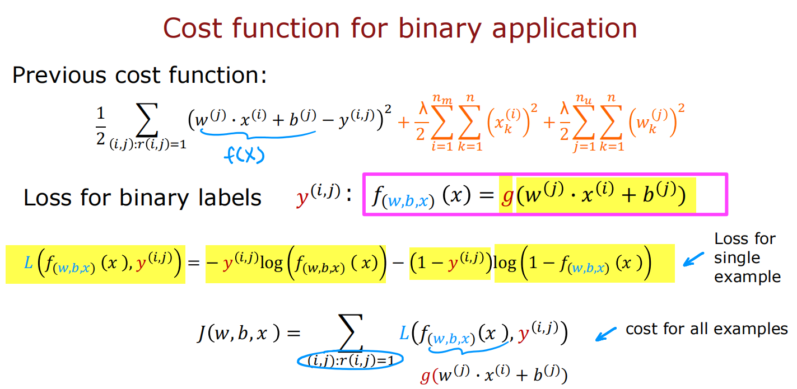

# 吴恩达机器学习第三部分

---

## 无监督学习

### 聚类

聚类算法寻找彼此相邻或相似的点，将其分组成簇（clusters），最常用的聚类算法为K-means算法，其思路如下（假设要将二维平面内若干个点分为两个簇）：
1. 随机初始化两个簇中心位置
2. 对每个样例点，判断其距离哪个中心点最近，将其分给该中心点代表的簇
3. 将两个中心点的坐标调整为该簇所有点坐标的平均值
4. 因为调整了簇中心的位置，样例点的分类可能会有变化，所以重复过程2和过程3，直到趋于稳定，即算法收敛

通过以上介绍可知，k-means算法其实也是在不断优化一个特定的代价函数，也称为畸变函数（distortion function），表示为：

其中， $c^{(1)}$ 到 $c^{(m)}$ 表示m个样例点各自的簇号， $\mu_1$ 到 $\mu_k$ 表示k个簇中心点的坐标，该代价函数即各个样本点与其簇中心点距离的平方均值。

对于k-means的初始化，一般随机选择k个（k为目标簇数）样例点的坐标值作为簇中心的初始值，然后开始算法直至收敛，但是由于初始取值的随机性，可能会陷入局部最小值，即收敛后的代价函数仍然不理想，所以要多次运行整个算法，例如100次，保证能够取到足够多种不同的初始值，选出100次算法里代价函数最小的情况作为最终聚类结果。

另外，在实际应用中，如何确定目标簇数（即k值）也很重要，可以用肘部法则来参考，即分别计算k值为1，2，3......时的最终代价值，找出大幅降低与趋于稳定的转折点k作为目标簇数，如图：

但是很多情况下很难找到明显的转折点，所以还需结合具体项目需求来人工判断目标簇数的合理值。

### 异常检测

异常检测算法通过观察正常事件的未标记数据集，从而能够判断测试事件是否异常。异常检测通常需要用到高斯分布（也称正态分布）来建模从而计算出数据取某个值的概率，计算公式为：

$$p(x)=\dfrac{1}{\sqrt{2\pi}\sigma}e^{\dfrac{-(x-\mu)^2}{2\sigma^2}}$$

其中 $\mu$ 为所有训练样本的平均值， $\sigma^2$ 为训练样本的方差，即

$$\mu=\dfrac{1}{m}\sum\limits_{i = 1}^{m}x^{(i)} 
\qquad
\sigma^2=\dfrac{1}{m}\sum\limits_{i = 1}^{m}(x^{(i)}-\mu)^2$$

对于实际的异常检测场景，通常会有很多不同的特征，需要对每个特征分别建立正态分布模型，按独立性将概率相乘即可，然后将最终概率与提前设置好的阈值 $\epsilon$ 相比较，若 $p(x)<\epsilon$ ，则认为是异常，如下图：

在构建算法时，选择好的特征非常重要，若一些异常数据未检测出来，分析该数据异常的具体原因，从而添加新的特征加强检测，若某个特征对应的已知数据与正态分布相差较大，则可对该特征做适当的变形使其贴合正态分布，如图：

另外，在很多时候异常检测与监督学习似乎都能使用，区别在于：异常检测更适合数据中绝大部分为正而一少部分为负的情况，监督学习适合正负数据都较多的情况，异常检测能发现各种新的异常类型，监督学习只擅长发现以前学习过的异常类型。

## 推荐系统

### 协同过滤算法

以电影推荐系统为例，每个用户对电影可以进行1到5星的评分，如何利用已有用户对部分电影的评分来预测他们的喜好，并对每个用户进行个性化的电影推荐，协同过滤是常用的方法。

协同过滤推荐算法的目标是生成两种向量：一种是体现每个用户电影口味的参数向量 $w$ ，一种是体现每部电影性质的特征向量 $x$ 。这两种向量维数相等，其点积加上偏差项 $b$ 就可以表示某用户给某电影评分的估计值。这些向量开始时随机初始化，通过不断迭代调整使得在已有数据上估计评分能较好拟合实际评分，从而训练出最合适的各种向量，这个过程所依据的代价函数如下图：

可见 $J$ 是 $w,b,x$ 的函数，三者同时训练，并加入对 $w$ 和 $x$ 的正则化来避免过拟合，该代价函数对应的梯度下降为：

$$w^{(j)}_i=w^{(j)}_i-\alpha\dfrac{\partial J(w,b,x)}{\partial w^{(j)}_i}$$

$$b^{(j)}=b^{(j)}-\alpha\dfrac{\partial J(w,b,x)}{\partial b^{(j)}}$$

$$x^{(i)}_k=x^{(i)}_k-\alpha\dfrac{\partial J(w,b,x)}{\partial x^{(i)}_k}$$

这种代价函数一般不在现成的库中，需要自定义并优化训练，TensorFlow代码如下：

如果将评分换成二元标签0和1，表示是否喜欢、是否收藏、是否点击等，则类似于逻辑回归，其代价函数也要做相应的变换：

### 基于内容的推荐

协同过滤有冷启动和解释性差的弱点，冷启动即新用户或新物品刚加入系统时缺少数据支撑很难进行推荐，解释性差是指生成的 $w$ 和 $x$ 向量每一维的实际含义不明，基于内容的推荐一定程度上可以弥补这些问题。

基于内容的前提是已有用户特征 $x^{(j)}_u$ 和物品特征 $x^{(i)}_m$ ，这两种向量维数可以不等，要找到用户和物品之间的良好匹配，需要生成同维的用户向量 $v^{(j)}_u$ 和物品向量 $v^{(i)}_m$ ，两者的点积即为预测值，而生成 $v^{(j)}_u$ 和 $v^{(i)}_m$ 需要使用神经网络：

其中用户网络输入 $x_u$ 输出 $v_u$ ，电影网络输入 $x_m$ 输出 $v_m$ ，两个网络的隐藏层架构可以不同，具有相对独立性，但又共同组成整体网络，代价 $J$ 是 $v^{(j)}_u$ 和 $v^{(i)}_m$ 的函数，可见两部分一起训练使得预测评分拟合实际评分。下图用TensorFlow实现了该神经网络的训练：

另外，有了 $x^{(i)}_m$ 或者 $v^{(i)}_m$ 我们可以通过计算两部电影之间的距离（对应项差值的平方和再开方）来找到彼此相似的电影。

在大规模实际应用中，要为某个用户做推荐时，若逐个计算该用户对所有电影的预测评分再挑选会很费时，常用的方法是检索+排序：

- 检索就是生成一个候选电影列表，其中的电影包括与该用户最近观看电影相似的电影、最常看类型里的高评分电影、该用户所在国家的热门电影等等，尽量通过多种方式涵盖可能喜欢的电影
- 把用户特征和候选列表中的电影特征输入预先训练好的神经网络，产生预测评分，排序后推荐靠前的电影

该方法相当于缩小了要计算的电影范围，不用遍历所有电影，节省时间与开销。

## 强化学习

### 基本概念

强化学习的关键在于奖励机制，它不告诉训练对象每个输入的正确输出是什么，而是通过奖励函数告诉对象什么时候做得好，什么时候做得不好，从而让训练对象学会自己选择最好的行为。强化学习的一些基本概念如下：

其中，回报（return）等于一系列奖励（reward）与折扣因子多次方乘积的和，策略函数 $\pi$ 能够说明每个状态（state）下的最佳动作（action）。这种形式的强化学习也被称为马尔科夫决策过程（MDP），其思想是未来只取决于当前状态，而不管当前状态之前所发生的任何事情。

在这些基础上，接着引入状态动作价值函数（也称 $Q$ 函数），表示为 $Q(s,a)$ ，其含义是在状态 $s$ 执行 $a$ 动作并在之后达到最优情况的回报，所以对于一个状态，可以计算它采取不同动作的 $Q(s,a)$ 来判断哪个动作最好，从而完成学习。而计算 $Q$ 函数需要使用贝尔曼方程：

此外，在实际应用中采取行动时结果并不完全可靠，比如在某位置向左移动会有小概率出现问题，结果向右移动，即下一个状态是不确定的，所以之前的公式需要修改为各种可能性下的期望值：

### 实例展示

以下用模拟月球登陆器来说明强化学习的具体实现：

该登陆器的状态由八维向量表示，向左、向右、向下和空四种动作由四维独热编码的向量表示，提前指定好各种情况的奖励，强化学习要做的就是训练神经网络来近似计算 $Q(s,a)$ 从而能为每种状态选择最佳动作。

如上图所示，将状态和动作视为输入 $x$ ，经过网络计算后得到输出 $y$ ，开始时随机初始化网络中的各个参数，将最近的一系列动作与状态作为训练数据，代价函数采用均方误差，其中计算误差需要预测输出与实际输出，预测输出即网络运算结果，实际输出用贝尔曼方程的计算结果来近似，通过梯度下降不断减小误差，从而优化参数最后得到较好的拟合，如下图：

网络训练完成后就可直接计算每个状态下采取不同动作的 $Q$ 函数值，选择最大值对应的动作。

另外，以上执行可进行一些改进：

如图，将输入调整为八维向量，不再需要动作信息，而是在输出层同时得到向左、向右、向下和空四种动作的 $Q$ 函数值，直接比较选出最优，这样的网络更为高效。 

另一个改进是 $\epsilon-greedy$ 策略，之前总是选择使得 $Q(s,a)$ 最大的动作，采用该策略后，将有 $\epsilon$ 的概率随机选择动作，例如在本例中当 $\epsilon$ 为0.05时，为每个状态选择动作时会有5%概率随机选择向左、向右、向下和空，剩余95%概率照旧，这样得到的数据更为真实和丰富，也避免陷入局部极端情况。

软更新（soft update）也有类似的形式，即每次更新参数时并不将旧值完全修改为新值，而是设置一个比例系数 $\lambda$ ，让结果等于 $\lambda$ 倍的新值加上  $(1-\lambda)$ 倍的旧值，这样能让参数修改更为平缓，防止突然有剧烈改变。