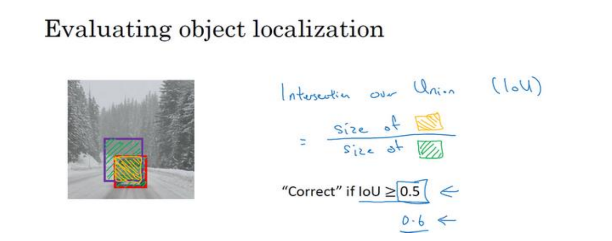
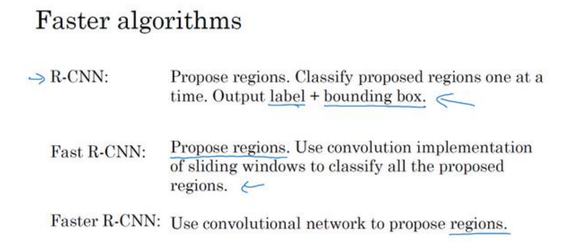
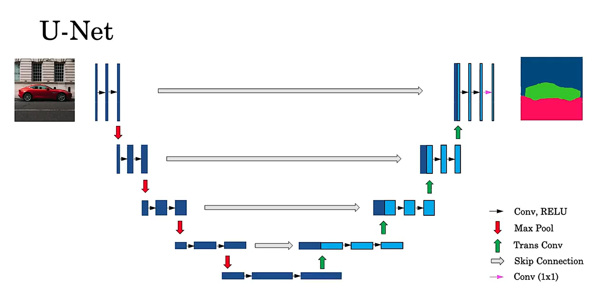

# 吴恩达深度学习第四部分

---

## 基本卷积神经网络

### 导入

普通神经网络在解决计算机视觉问题时要面临一个挑战，就是数据的输入可能会非常大，比如一张1000×1000的图片，其特征向量的维度达到了1000×1000×3，因为有3个RGB通道，所以数字将会是300万。在第一个隐藏层中，如果设置1000个神经元，所有权值组成矩阵 $W^{[1]}$ ，则 $W^{[1]}$ 会有30亿个参数，这是个非常巨大的数字，对计算机内存与算力要求很高，也很难避免过拟合。

卷积神经网络则可以很大程度上减少计算量，以边缘检测为例介绍基本的卷积运算：

那么如何完成与上图类似的边缘检测呢，假设给出一个6×6×1的灰度图像，为了检测图像中的垂直边缘，可以构造一个3×3矩阵，在卷积神经网络的术语中，它被称为过滤器。对这个6×6的图像进行卷积运算，卷积运算用“∗”来表示，如下图：

这个卷积运算的输出将会是一个4×4的矩阵，可以将它看成一个4×4的图像。为了计算第一个元素，将原矩阵左上角的九个数字与过滤器对应的9个数字分别相乘再求和。之后将过滤器右移，再计算乘积和得到第二个元素，以此类推算出所有结果。若将过滤矩阵转置再进行卷积运算，则能检测图像的水平边缘。

随着深度学习的发展，真正要去检测出复杂图像的边缘时不一定要用规定的这9个数字，而是把这9个数字当成9个参数，使用反向传播算法自动确定最好的值，从而检测出任何想要的边缘，该思想是计算机视觉的核心思想之一。

### 概念

#### 填充（Padding）

由之前的介绍可知，如果用一个3×3的过滤器卷积一个6×6的图像，最后会得到一个4×4的输出，也就是一个4×4矩阵。那是因为3×3过滤器在6×6矩阵中，只可能有4×4种可能的位置。这背后的数学解释是，如果我们有一个𝑛×𝑛的图像，用𝑓×𝑓的过滤器做卷积，那么输出的维度就是(𝑛−𝑓+1)×(𝑛−𝑓+1)。

这样的话会有两个缺点：第一个缺点是每次做卷积操作，图像就会缩小，从6×6缩小到4×4，可能做了几次之后，图像就会变得很小了，我们并不想让图像在每次识别边缘或其他特征时都缩小；第二个缺点是，如果注意中间的像素点，会有许多3×3的区域与之重叠，而角落或者边缘的像素点只被一两次输出所使用，所以其实丢掉了图像边缘位置的许多信息。

为了解决这些问题，可以在卷积操作之前填充这幅图像。在这个案例中，我们可以沿着图像边缘再填充一层像素，那么6×6的图像就被填充成了一个8×8的图像，此时再用3×3的图像对这个8×8的图像卷积，得到的输出就不是4×4的，而是6×6的图像，尺寸和原始图像相等。习惯上可以用0去填充，如果𝑝是填充的数量，输出也就变成了(𝑛+2𝑝−𝑓+1)×(𝑛+2𝑝−𝑓+1)。

至于填充多少像素，通常有两个选择，分别叫做Valid卷积和Same卷积：Valid卷积意味着不填充，这样的话，如果你有一个𝑛×𝑛的图像，用一个𝑓×𝑓的过滤器卷积，它将会给你一个(𝑛−𝑓+1)×(𝑛−𝑓+1)维的输出；Same卷积意味着填充后的输出大小和输入大小是一样的，即让𝑛+2𝑝−𝑓+1=𝑛，求解得𝑝=(𝑓−1)/2，在计算机视觉中𝑓通常是奇数，所以计算得到的𝑝是一个整数。

#### 步长（Stride）

卷积中的步幅是另一个构建卷积神经网络的基本操作，如下图：

和之前不同的是，把步幅设置成了2，则卷积的结果是3×3的矩阵，因为过滤器每次移动两个位置。如果用一个𝑓×𝑓的过滤器卷积一个𝑛×𝑛的图像，填充数为𝑝，步幅为𝑠，则输出为 $\lfloor \dfrac{n+2p-f}{s} + 1 \rfloor × \lfloor \dfrac{n+2p-f}{s} + 1 \rfloor$ 的矩阵。

#### 三维卷积

以上所做的都是对二维图像的卷积，而RGB彩色图像是6×6×3，这里的3指的是三个颜色通道，可以把它想象成三个6×6图像的堆叠。为了检测彩色图像的边缘或者其他的特征，不是把它跟原来的3×3过滤器做卷积，而是跟一个三维的过滤器，它的维度是3×3×3，即过滤器也有三层，对应红、绿、蓝三个通道：

为了计算这个卷积操作的输出，需要把这个3×3×3的过滤器先放到最左上角的位置，依次取27个数乘以相应的红绿蓝通道中的数字，然后把这些数都加起来，就得到了输出的第一个数字。如果要计算下一个输出，就把这个立方体滑动一个单位，再与对应的27个数相乘并求和，以此类推。按照计算机视觉的惯例，输入有特定的高宽和通道数时，过滤器可以有不同的高和宽，但是必须是一样的通道数。

如果我们不仅想要检测垂直边缘怎么办？如果我们同时检测垂直边缘和水平边缘，还有45°倾斜的边缘，还有70°倾斜的边缘怎么做？换句话说，如果想同时用多个过滤器怎么办？如下图：

RGB图像和第一个过滤器卷积，可以得到第一个4×4的输出，然后卷积第二个过滤器，得到一个不同的4×4的输出，把这两个输出堆叠在一起就得到了一个4×4×2的输出立方体，即输出的通道数等于过滤器数。

#### 1×1卷积

1×1卷积是一种特殊的三维卷积，即过滤器大小为1×1×通道数，而使用1×1卷积来构建瓶颈层可以大大降低计算成本，例子如下：

这是一个28×28×192的输入块，执行5×5的same卷积，它有32个过滤器，所以输出为28×28×32，可知乘法运算共进行了120M次，使用1×1卷积可以达到相同效果：

该方法分两步，先把通道数减少，再使用5×5的same卷积，计算次数在该例中下降到了原来的十分之一。

### 层次

#### 卷积层

上文已经说明了如何通过两个过滤器卷积处理一个三维图像，并输出两个不同的4×4矩阵，这两个过滤器就类似于普通神经网络一层中的两个神经元，卷积操作就类似于用权重 $w$ 与 $x$ 相乘，所以还缺少偏置值和激活函数。现在为每个过滤器增加一个偏置值，它是一个实数，通过Python的广播机制给这16个元素都加上同一偏差。然后应用非线性函数，比如激活函数ReLU，输出结果是一个4×4矩阵。对于第二个4×4矩阵，加上不同的偏差，然后应用激活函数ReLU，得到另一个4×4矩阵，把这两个矩阵堆叠起来，最终得到一个4×4×2的矩阵即为该层输出。这便是一个完整的卷积层，如下图：

示例中我们有两个过滤器，也就是有两个特征，因此我们才最终得到一个4×4×2的输出。如果我们用了10个过滤器，而不是2个，我们最后会得到一个4×4×10维度的输出图像。此时该层参数一共有(27+1)×10=280个，不论输入图片有多大，1000×1000也好，5000×5000也好，参数始终都是280个，这就是卷积神经网络的一个特征，避免了过拟合。

然后我们总结一下用于描述卷积神经网络中的一层（以𝑙层为例）所需要的标记：

#### 池化层

除了卷积层，卷积网络也经常使用池化层来缩减模型的大小，加快计算速度，同时提高所提取特征的鲁棒性，如下图：

该图中用到的池化类型是最大池化（max pooling），输入是一个 4×4矩阵，执行最大池化的是一个2×2矩阵，步幅设置为2，分别选出了4个区域的最大值。如果输入是三维的，那么输出也是三维的，例如输入是4×4×3，那么输出就是2×2×3，计算最大池化的方法就是分别对每个通道执行上述的计算过程。

另外还有一种类型的池化叫平均池化，它不太常用。这种运算顾名思义，选取的不是每部分的最大值，而是平均值，如下图：

对于池化层需要注意的是，它有一组超参数即过滤器大小𝑓和步幅𝑠，常设置为𝑓=2，𝑠=2，其效果相当于高度和宽度缩减一半。池化层并没有参数需要学习，它就是一个固定运算，梯度下降无需改变任何值。

#### 全连接层

全连接层就是普通神经网络的一层，它通常位于若干卷积层和池化层之后，对数据做进一步的处理并输出，所以一个典型的卷积神经网络需要包含卷积层、池化层和全连接层三部分，如下图：

该图是32×32的RGB图片做手写体数字识别，整个网络共有两个卷积+池化层，然后将数据展平为一列，再经过两个全连接层，最后得到softmax层输出。一般随着神经网络深度的增加，高度和宽度会减小，而通道数量会增加。

## 经典卷积网络模型

### LeNet-5

LeNet-5和上面举的例子很类似，只是把输入变成了32×32×1的灰度图像，且用的是平均池化，以及激活使用tanh函数，如下图：

### AlexNet

上图即为AlexNet结构，输入是227×227×3的图片，输出是1000种可能的分类。这种结构与LeNet有很多相似之处，不过AlexNet要大得多，LeNet大约有6万个参数，而AlexNet包含约6000万个参数，AlexNet比LeNet表现更为出色的另一个原因是它使用了ReLu激活函数。

经典的AlexNet结构还有另一种类型的层，叫作“局部响应归一化层，即LRN层，这类层如今应用并不多，大致思路是，比如对于13×13×256的数据，LRN要做的就是选取一个位置，从这个位置穿过整个通道，能得到256个数字，并进行归一化，从而减少高激活值。

### VGG-16

如图，VGG-16网络层数很多，参数量巨大，但优点在于结构规整，都是几个卷积层后面跟一个池化层，随着网络的加深，图像的高度和宽度通过池化层不断减半，而通道数量通过卷积层不断翻倍。

### 残差网络

非常深的神经网络是很难训练的，因为存在梯度消失和梯度爆炸问题，而残差网络（ResNets）解决了这个问题。其核心是通过“捷径（shortcut）”或者说“跳跃连接（skip connection）”让某一层的值迅速反馈给更深层，即允许梯度直接反向传播到更浅的层：

上图是一个幅度为两层的残差块，将 $a^{[l]}$ 向后传送参与 $a^{[l+2]}$ 的生成。残差块具体有两种类型，主要取决于输入输出的维度是否相同：

一种称为恒等块（Identity block），对应于捷径和主路径要相加的两部分数据维度相同，如下图（幅度为三层）：

另一种称为卷积块（Convolutional block），对应于两部分数据维度不同，所以在支路上要对数据做卷积来使其符合主路径的数据维度，如下图（幅度为三层）：

将多个残差块连接在一起，并结合之前学习的结构就形成了残差网络，下图是ResNet-50模型：

### Inception网络

构建卷积层时，需要人为决定过滤器的大小究竟是1×1、3×3还是 5×5，以及要不要添加池化层，Inception网络的作用就是把可能的情况都加入，让机器通过学习自行决定，虽然网络架构因此变得更加复杂，但表现却非常好，如下：

将这些不同过滤器大小生成的same卷积层拼在一起作为整体，这就是一个Inception块：

将多个Inception块连接在一起，并结合之前学习的结构就形成了Inception网络：

整个网络中有一些分支，即序号2、3、4、5标注的地方，意思是中途也通过全连接以及softmax产生输出，这些输出可作为最终输出的补充和对照，起到调整效果，并且能防止网络发生过拟合。

## 目标检测

### 介绍

之前的应用都是图像识别或称为图像分类，而目标检测是更为复杂的任务，不仅要用算法判断图片中是不是有特定目标，还要在图片中标记出它的位置，用边框将其圈起来，图片可以含有多个对象，甚至单张图片中会有多个不同分类的对象。一个基础的例子如下：

加入正在构建汽车自动驾驶系统，那么对象可能包括以下几类：行人、汽车、摩托车和背景，这四个分类就是softmax函数可能输出的结果。这就是标准的分类过程，如果想进一步定位图片中汽车的位置，可以让神经网络再多输出4个数字，标记为𝑏𝑥,𝑏𝑦,𝑏ℎ和𝑏𝑤，这四个数字是被检测对象的边界框的参数化表示。

一般约定图片左上角的坐标为(0,0)，右下角标记为(1,1)，要确定边界框的具体位置，需要指定红色方框的中心点，这个点表示为(𝑏𝑥,𝑏𝑦)，边界框的高度为𝑏ℎ，宽度为𝑏𝑤。所以在监督学习下输出标签y变为：

y是一个向量，第一个元素𝑝𝑐表示是否含有对象，如果对象属于前三类（行人、汽车、摩托车），则𝑝𝑐 = 1，之后紧跟边界框参数和类别，如果是背景，即图片中没有要检测的对象，则𝑝𝑐 = 0，之后的7个元素不再关心。

最后，需要提及一下此时的损失函数，当𝑦1 = 1，即图片中确实存在定位对象时，损失值等于每个元素相应差值的平方和；当𝑦1 = 0，即图片中不存在对象时，损失值仅仅是𝑦1和𝑝𝑐差值的平方和，不用关注其他元素。

### 滑动窗口及其卷积实现

如图，假如想构建一个汽车检测算法，一般首先创建一个标签训练集，也就是𝑥和𝑦表示适当剪切的汽车图片样本，即使汽车居于中间位置，并基本占据整张图片。有了这个标签训练集，就可以开始训练卷积网络，完成后用它来实现滑动窗口目标检测，具体步骤如下：

首先选定一个特定大小的窗口，将红色方块内的图像输入卷积神经网络，卷积网络开始进行预测，判断该方框内有没有汽车，接下来会继续处理第二个图像，即红色方框稍向右滑动之后的区域，依次执行操作，直到这个窗口滑过图像的每一个角落。接着选择一个更大的窗口，能够截取更大的区域，再以某个固定步幅滑动窗口，重复以上操作，遍历整个图像，输出结果。然后第三次重复操作，这次选用更大的窗口。以此类推，不论汽车在图片的什么位置，总有一个窗口可以检测到它。

这种算法叫作滑动窗口目标检测，它将检测问题转化成了图像分类问题，但明显的缺点就是计算成本太高，而通过卷积来实现滑动窗口就能很大程度上改善该问题：

如图，假设输入给卷积网络的图片大小是14×14×3，测试集图片是16×16×3，在最初的滑动窗口算法中，会把14×14×3的蓝色区域输入卷积网络生成0或1分类，接着滑动窗口，步幅为2个像素，将新的区域输入给卷积网络，得到另外一个标签0或1，继续重复最后一共输出了4个标签。

而全卷积的方法是对整个16×16×3图片进行相同的卷积操作，得到了2x2的输出，而这个2x2的每个元素都是和原图一一对应的，这样一次CNN计算就可以实现窗口滑动的所有子区域的分类预测，之所以可以实现这样的效果是因为卷积操作的特性，就是图片的空间位置信息的不变性。

### YOLO算法

#### 基本思路

上面尽管可以减少滑动窗口的计算量，但只是针对一个固定大小与步长的窗口，很难得到最精准的边界框。Yolo算法很好地解决了这个问题，它不再是窗口滑动了，而是直接将原始图片分割成互不重合的小方块，比如3×3的网格（实际实现时会用更精细的网格，可能是19×19），然后对每个方格使用图像分类和定位算法：

这张图有两个对象，YOLO算法做的就是，取两个对象的中点，然后将这个对象分配给包含对象中点的格子，所以左边的汽车就分配到4号格子，右边的汽车分配给6号格子。对于9个格子中任何一个，都会得到一个8维输出向量，所以总的输出尺寸是3×3×8。需要注意的是，对每个格子约定其左上角的坐标为(0,0)，右下角标记为(1,1)，此时边界框的高度𝑏ℎ和宽度𝑏𝑤允许大于1。

该方法显式地输出边界框坐标，可以具有任意宽高比，不会受到滑动窗口分类器的步长和大小限制。而且这是一个卷积实现，并没有在 3×3网格上跑9次算法，而是只使用了一个全卷积网络，有很多共享计算步骤，直接得到所有结果（即only look once），所以这个算法效率很高，可以达到实时识别。

#### 交并比与非极大值抑制

交并比（loU）就是计算两个边界框交集和并集之比，经常用来评估目标检测效果。如果预测框和实际边界框完美重叠，loU就是1，因为交集等于并集，在计算机检测任务中，一般约定如果𝑙𝑜𝑈≥0.5，就认为检测正确，如果想更严格一点，可以把阈值定为0.6或更高。

目前为止学到的对象检测中存在一个问题，就是算法可能对同一个对象做出多次检测，非极大值抑制可以确保对每个对象只检测一次，以下图为例：

假设需要在这张图片里检测汽车，可能会在上面放个19×19网格，理论上每辆车只有一个中点，所以它应该只被分配到一个格子里，所以应该只有一个格子做出有车的预测，实践中当运行对象分类和定位算法时可能会有多个相邻的格子对同一个目标做出预测。

所以具体来说，非极大值抑制做的是，首先看每个检测结果相关的概率𝑝𝑐，首先看概率最大的那个，即最可靠的检测，将其用高亮标记，这么做之后，非极大值抑制就会逐一审视剩下的矩形，所有和这个高亮边框有很高交并比，高度重叠的其他边界框就会被抑制。不断重复以上过程就会对每个目标保留一个最佳边框而删去其他边框。如果要同时检测多类对象，比如说行人、汽车、摩托，那么输出向量就会有三个额外的分量，正确的做法是独立进行三次非极大值抑制，对每个输出类别都做一次。

#### 锚框（anchor boxes）

介绍到目前为止，还存在的一个问题是每个格子只能检测出一个对象，如果想让一个格子检测出多个对象，可以使用“anchor box”这个概念，以下图为例：

假设有这样一张图片，行人的中点和汽车的中点几乎在同一个地方，两者都落入到同一个格子中，原先的y输出无法同时表示两者的位置。而anchor box的思路是，预先定义两个不同形状的锚框（一般人工指定，属于超参数），要做的是把预测结果和这两个锚框关联起来（实际应用中可能需要5个甚至更多的锚框，但对于这个例子两个足以说明），一个用来匹配行人，一个用来匹配汽车，所以输出y需要在以前的基础上再重复一次，现在每个对象不仅是分配到其中点所在的格子中，还要分配到和对象形状交并比最高的锚框中。

### R-CNN算法

R-CNN是另一个比较有名的目标检测算法，其核心概念是候选区域。回到基础的滑动窗口算法，其效率低的主要原因就是它需要为不同位置和大小的窗口运行分类和定位，而其中大量位置并没有需要检测的对象，浪费了不少时间，而R-CNN即带候选区域的卷积网络，尝试选出一些它认为有意义的区域，在这些区域上运行卷积网络分类器，不用全部运行。

如上图，选出候选区域的方法是运行图像分割算法，在分好的色块上加窗口检测，需要说明的是R-CNN算法不会直接信任输入的边界框，它会输出𝑏𝑥，𝑏𝑦，𝑏ℎ和𝑏𝑤，这样得到的边界框很精确。但R-CNN算法还是比较慢，所以后续出了Fast R-CNN和Faster R-CNN：

## 语义分割

### 介绍

目标检测是用方框圈住对象，而语义分割更进一步，以像素为单位绘制出对象的精细轮廓，如下：

### U-Net

#### 转置卷积

正常卷积的输出维度小于等于输入维度，而转置卷积要让输出维度扩大：

如上图，输入是2×2，输出是4×4，选择3×3的过滤器，填充量为1（此时是对输出进行填充），步幅为2。将输入的每个元素乘上过滤器的各个数字并放在输出的对应位置上，如有重叠则将数字相加，即可得到结果。

#### 网络结构

普通的卷积网络一般会随着层数增大而减小宽和高，提高通道数，但语义分割要在原图片的像素级别上进行标记，所以最后的宽和高不能降低，这就要用到转置卷积，基本框架如下：

可见在缩小后又要进行扩大，最终回到原来尺寸的长度和宽度，另外，还要加上一个早期层到后期层的直接连接，这样就既有经过多层提取的高级特征，又有原始图片的像素数据，二者结合完成语义分割。将这个思路推广开来就得到了完整的U-Net结构：

## 具体应用

### 人脸识别

#### 介绍及思路

人脸识别问题严格来说分为两类：

- 人脸验证：比如使用脸部解锁的手机，通常这一类是1：1匹配问题
- 人脸识别：比如学校门禁刷脸进出，此类则是1：K匹配问题

如果获得两张图像，要确定是否表示同一个人，最直接的想法是逐像素比较两个图像，如果原始图像之间的距离小于选定的阈值，则可能是同一个人。此算法的性能很差，因为像素值会由于光照、人脸方向、甚至头部位置的微小差异而急剧变化。可行的思路是将人脸图像通过神经网络编码为数字向量（比如128维），这样对该编码进行逐元素比较就可以更准确地判断：

所以实际要做的就是训练一个网络（可以选择inception模型作为初始网络），使得它计算出的编码可以表示提取到的图片特征，从而确定两张图片是否是同一个人，完成人脸验证，而识别问题则多次比较即可，本质相同。

#### 损失函数

要具体训练网络模型中的各个参数，就要定义损失函数，一种经典想法就是三元组损失。三元组用（A,P,N）表示：其中A是“锚示例”图像；P是“正示例”图像，即与锚示例图像相同的人的照片；N是“负示例”图像，即与锚示例图像不同的人的照片。triplet loss函数尝试将“同一个人（锚点和正向）”的两个图像的编码“推”得更近，同时将另外一个人（锚点，负向）的两个图像的编码“拉”得更远，即要满足：

移项后稍加处理就得到损失函数：

其中 $\alpha$ 称为边距，它是一个可以手动调节的超参数。该损失函数想要最小，就要让第一项小于等于0，即同一个人的编码加上边距小于等于不同人的编码，所以使用该损失函数很合理。

这是一个三元组定义的损失，整个网络的代价函数就是训练集中单个三元组损失的总和。假如有一个10000个图片的训练集，里面是1000个不同的人的照片，要做的就是取这10000个图片，然后尽可能构造比较接近的三元组，训练学习算法，对这种代价函数用梯度下降。所以在训练阶段，同一个人是需要多张照片的，至少是一部分人需要。现在的人脸识别系统，尤其是大规模的商业人脸识别系统都是在很大的数据集上训练，所以一个实用操作就是下载别人的预训练模型。

最后值得一提的是，除了三元组损失，用最基础的二元分类法也可以解决问题：

此时训练集不是三个一组，而是两个一组，目标标签1表示这对图片是一个人，目标标签0表示图片中是不同的人，利用不同的成对图片，使用反向传播算法去训练神经网络，这样效果也很好。

### 画风迁移

#### 介绍和思路

画风迁移也叫神经风格迁移，如下所示，它将“内容”图像（Content）和“风格”图像（Style）合并在一起，以创建“生成”图像（Generated）：

要构建一个神经风格迁移系统，就要为生成的图像定义一个代价函数，通过最小化代价函数，就可以生成想要的任何图像。一般把这个代价函数分为两个部分，一部分是 $J_{content}(C,G)$ ，用来度量生成图片𝐺的内容与内容图片𝐶的内容的差异，另一部分是 $J_{style}(S,G)$ ，用来度量生成图片𝐺的风格和风格图片𝑆的风格的差异，两部分结合起来得：

$$J(G) = \alpha J_{content}(C,G) + \beta J_{style}(S,G)$$

需要注意的是，神经风格迁移使用已经训练好的卷积网络，并以此为基础，比如VGG-19，能够识别各种低层特征和高层特征。所以此时梯度下降优化代价函数并不是修改网络中的参数，而是每次直接修改生成图像的各点像素。

#### 内容代价函数

因为ConvNet的底层倾向于检测诸如边缘和简单纹理之类的低层特征，而深层则倾向于检测更复杂的高层特征，所以在网络中间选择一个层 $l$ ，既不会太浅也不会太深，用该层的激活来表示图像的内容，这样内容代价函数就可以定义为：

$$ J_{content}(C,G) = ||a^{[l][C]} - a^{[l][G]}||^2 $$

#### 风格损失函数

相比于内容，图像的风格更难度量，一般将图片的风格定义为𝑙层中各个通道之间激活项的相关系数。比如说，现在将𝑙层的激活项取出，这是个𝑛𝐻×𝑛𝑊×𝑛𝐶的激活项，它是一个三维的数据块：

可能其中某一条通道能找出图片中的特定位置是否含有垂直纹理，另一条可以粗略地找出橙色的区域，相关系数这个概念提供了一种去测量这些不同特征关联程度的方法，即它们在图片中的各个位置同时出现或不同时出现的频率，而这就能用来代表风格。

所以要做的是分别计算风格图像与生成图像对应的风格矩阵，具体地：

用符号𝑖，𝑗表示下界，将𝑖,𝑗,𝑘位置的激活项 $a_{i,j,k}^{[l]}$ 乘以另一个通道同样位置的激活项，也就是 $a_{i,j,𝑘'}^{[l]}$ ，再让这些不同位置的激活项乘积都加起来。𝑘和𝑘′会在1到𝑛𝑐之间取值，所以最后的结果是个𝑛𝑐×𝑛𝑐的矩阵，代表了不同通道间的关联程度，如下图：

对生成图像也做相同的运算：

然后计算两个风格矩阵的距离，来衡量风格差异程度。到目前为止，仅从一层捕获了风格特征，如果从几个不同的层“合并”风格损失将获得更好的结果：

