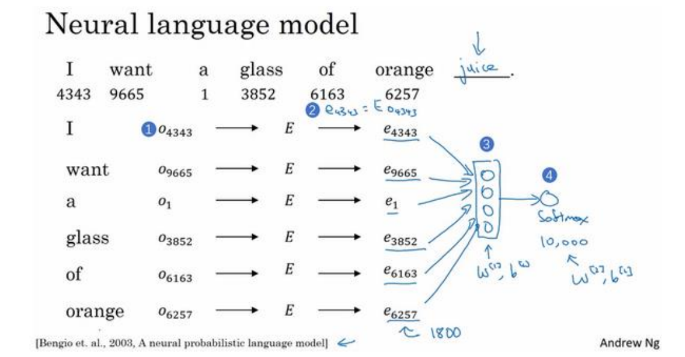

# 吴恩达深度学习第五部分

---

## 导入

序列模型，是深度学习中最令人激动的内容之一，以下例子都有效使用了序列模型：

所有这些问题都可以被称作使用标签数据 (𝑥, 𝑦) 作为训练集的监督学习。但从这一系列例子可以看出序列问题有很多不同类型：有些问题里，输入数据𝑥和输出数据𝑦都是序列，即使如此，𝑥和𝑦有时也会不一样长；在另一些问题里，只有𝑥或只有𝑦是序列。

再如上图，在这个特定例子中，要构建能够自动识别句中人名位置的模型，这个输入数据是9个单词组成的序列，用 $x^{<1>}$、$x^{<2>}$ …… $x^{<9>}$ 表示，输出数据用 $y^{<1>}$、$y^{<2>}$ …… $y^{<9>}$ 表示对应位置是否是人名。

想要表示句子里的单词，就需要一张词表，也称为词典，比如词典收录了最常用的10,000个单词，接下来就可以用 one-hot 编码来表示词典里的每个单词。这样，就构成了一套符号来表述训练集里的序列数据𝑥和𝑦，之后的内容就是如何构建𝑋到𝑌的映射。

## 循环神经网络（RNN）

### 基本实现

循环神经网络（RNN）在解决自然语言处理和其他序列任务上非常有效，因为它们具有“记忆”，可以一次读取一个输入 $x^{<t>}$（例如单词），并通过从一个时间步传递到下一个时间步的隐藏层激活来记住一些信息/上下文，这使得单向RNN可以提取过去的信息以处理之后的输入，如下图（两种画法）：

循环神经网络可以看作是单个cell的重复，所以首先要在单个时间步上实现计算，下图描述了RNN单元的单个时间步的操作：

可见每个单元格都将前一个单元格 $a^{<t-1>}$的隐藏状态和当前时间步的数据 $x^{<t>}$作为输入，并为此时间步输出隐藏状态 $a^{<t>}$和预测 $y^{<t>}$。另外，这两个核心等式可以简化记为：

将刚刚构建的单元重复就得到了RNN，如果输入的数据序列经过n个时间步长，则将复制RNN单元n次，下图是RNN的前向传播：

### 反向传播

在编程框架中实现循环神经网络时，框架通常会自动处理反向传播，此处对原理做一个简单介绍：

如上图，首先需要定义损失函数，关于单个位置上或者说某个时间步𝑡上具体单词的预测值采用标准逻辑回归损失函数，也叫交叉熵损失函数（Cross Entropy Loss），整个序列的损失函数就是把各个时间步的损失函数加起来。然后就可以从右向左反向传播，也叫做穿越时间的反向传播，其链式求导如下：

结合前向传播时留下的cache即可完成以上计算，从而更新参数值。

### 常见类型

以上介绍的RNN结构，它的输入量 $T_x$ 等于输出数量 $T_y$ ，事实上对于其他一些应用，两者并不一定相等：

如上图，“一对一”就是标准的神经网络，和RNN关系不大，“一对多”常用于音乐生成，“多对一”常用于情感分类，“多对多”中等长可用于人名识别，不等长可用于语言翻译。

### 序列采样

在训练好一个序列模型之后，要想了解到这个模型学到了什么，一种非正式的方法就是进行一次新序列采样：

如图，上半部分是训练过程，下半部分是采样过程，此时输入 $x^{<1>} = 0$， $a^{<0>} = 0$，第一个时间步得到的是所有可能单词的概率，然后根据这个概率进行随机抽样从而确定 $\hat{y}^{<1>}$，第二个时间步再把 $\hat{y}^{<1>}$作为输入继续计算概率并抽样，不断重复此过程，直至达到规定的时间步或者得到 EOS（表示句子的结束）。

另外，根据实际应用，还可以构建一个基于字符的RNN结构，那么序列单位 $x^{<t>}$ 和 $y^{<t>}$ 将会是单独的字符而不是单词。使用基于字符的语言模型优点在于不会出现未知的标识，因为所有字符都能包含在字典中，可以组合出任何内容，缺点在于得到的序列较长，计算成本高，而且不善于捕捉长范围的依赖关系，所以目前应用不够广泛。

### 梯度消失

基本的 RNN 算法还有一个很大的问题，就是梯度消失：

训练很深的神经网络时，随着层数的增加，导数有可能指数型下降或者指数型增加，比如RNN处理1000个时间序列的数据集，这就是1000层的神经网络，这样的网络就会遇到上述问题。梯度爆炸基本上用梯度修剪就可以应对，但梯度消失比较棘手，这意味着RNN很难长时间记住前面的信息，只能被最近的信息影响。为了解决梯度消失，需要对基本的RNN进行改造，常用GRU（门控循环单元）或者LSTM（长短期记忆）来达到目的。

#### GRU

相比于普通RNN单元，GRU单元将会有个新的变量称为𝑐，代表细胞（cell）。该细胞提供了记忆能力，比如说一只猫是单数还是复数，当它看到之后的单词时，它仍能够判断句子的主语是单数还是复数。在时间步𝑡有记忆细胞$c^{<t>}$，对GRU来说$c^{<t>}$的值就等于$a^{<t>}$的值。此外，GRU单元还需要两个门控，代表更新的$\Gamma_u$ 和代表相关的 $\Gamma_r$ ，具体计算公式如下：

首先用当前时间步的输入$x^{<t>}$ 和上一个时间步的记忆值 $c^{<t-1>}$ 算出 $\Gamma_u$ 和 $\Gamma_r$，然后结合 $\Gamma_r$ 计算此时间步记忆细胞的候选值 $\widetilde{c}^{<t>}$，最后结合 $\Gamma_u$ 得到记忆细胞的实际值 $c^{<t>}$，门控信号 $\Gamma_u$ 越接近1，代表越偏重于使用新计算的候选值，而越接近0则代表越偏重于沿用旧值。

GRU使用了一个门控 $\Gamma_u$ 就同时可以进行遗忘和选择记忆（LSTM则要使用多个门控），所以相对容易计算。

#### LSTM

LSTM比GRU更早提出，也比GRU更加全面和通用，其示意图如下：

可见，首先$c^{<t>}$的值和$a^{<t>}$的值不再相等，需要独立计算和传播，然后对于记忆和遗忘使用了两个不同的门控，即 $\Gamma_u$ 和 $\Gamma_f$，不需要表示相关的门控，而是需要输出门控 $\Gamma_o$ 来计算 $a^{<t>}$。将多个这样的单元连接起来就得到了LSTM网络，也就是优化版的RNN。

### 其他改进

#### 双向RNN

很多情况下，只有之前的信息是不够的，还需要当前时间步之后的信息才能做出判断，所以需要将传统RNN改为双向RNN：

如上图，给定一个输入序列 $x^{<1>}$到 $x^{<4>}$，不仅要从左到右计算 $a^{<1>}$到 $a^{<4>}$，还要从右到左计算另一系列的 $a^{<4>}$到 $a^{<1>}$，每一时间步都要结合两个方向对应的激活值来预测输出，所以双向RNN的前提条件是事先知道完整序列。另外，双向RNN中的单元不一定是标准RNN单元，也可以是GRU或者LSTM单元。

#### 深层RNN

如果要学习非常复杂的函数，通常会把RNN的多个层堆叠在一起构建更深的模型：

相当于每一个时间步多加了几层，此时用 $a^{[l]<t>}$来表示第 $t$ 个时间步第 $l$ 层的激活值，它由左边（前一步同一层）和下方（前一层同一步）的传输值共同决定。对于RNN来说，有三层就不少了，因为本身还有时间的维度，总层数很多。同样，深层RNN单元不一定是标准RNN单元，也可以是GRU或者LSTM单元。

## 词嵌入及其应用

### 词嵌入介绍

自然语言处理相关任务中要将语言交给机器学习中的算法来处理，所以需要将语言中的单词数学化，用向量来表示。之前介绍的是用词典的独热编码来表征一个单词，但这种方法存在很多问题：首先是维数很高，当词汇量达到千万级别时每个单词都是千万维的向量，内存无法承受；另外就是语义鸿沟，词和词的向量表示无法衡量相似性；最后还有独热编码中大量的0带来的强稀疏性。

而词嵌入就是用特征化的方法来表示每个单词，如下图：

可见，单词要在性别、皇室、年龄、食物等特征上赋值，从而多方位展现一个单词的含义，实际会使用300维或者更高维度的嵌入（embedding），类似于人脸识别中得到的特征编码（encoding）。

有了词嵌入就可以计算不同单词间的相似度，从而完成类比推理，例如：

也可以使用经典的余弦相似度：

### 学习词嵌入

首先需要说明的是，词嵌入不是人为赋值，也不是单独训练，而是和具体的语言模型同时训练得到的，或者说词嵌入是语言模型参数训练的副产物。想得到全面又精确的词嵌入，通常需要在大量文本集的基础上通过算法来学习，所以在实际NLP任务中可以通过迁移学习来直接使用别人已经训练好的词嵌入，这样的话即使自己的训练集很小也能达到不错的效果。

下面先介绍比较基础的能够学习词嵌入的语言模型：

假如在构建语言模型来预测一句话的下一个词，首先要有一个随机初始化的嵌入矩阵，如果词汇表含有10000个单词，词嵌入维数为300，则嵌入矩阵为300×10000，每一列代表不同单词的嵌入向量。将上下文已经出现的单词向量输入到神经网络中，经过softmax层预测目标单词，然后不断梯度下降迭代从而得到对训练集拟合效果最好的神经网络参数以及词嵌入。这个过程中很重要的一个超参数就是上下文范围，比如可以选择目标单词的前四个单词来对目标做预测，也可以选择前后各四个单词，或者只选目标单词的前一个单词，不同选择的效果各有所偏重，要根据需求进行设置。

#### Word2Vec

Word2Vec算法是一种简单而且计算更高效的方式来学习词嵌入，分为两种模型：

- CBOW：以上下文词汇预测当前词，对小型数据集比较合适
- Skip-gram：以当前词预测上下文词汇，在大型语料中表现更好

以Skip-gram为例进行介绍，先看最简单情况下的模型，即用当前词x预测它的下一个词y，如下图：

模型只有三层，输入是x的独热向量，输出是一个同样维度的向量，代表每个单词是y的概率，前半部分的参数矩阵就是词嵌入矩阵，隐藏层就是向量的词嵌入，在不断训练的过程中会逐渐精确。推广到更一般的模型就是以x预测上下文的多个y：

实际使用这个算法时会遇到计算速度的问题，因为本质上是要进行多分类，当词汇量很大时运算会比较慢，所以有两种优化方案：多层分类（把N分类问题变成log(N)次二分类）和负采样（预测总体类别的一个子集）。

可见，多层分类结构是把输出层改成了一颗哈夫曼树，关于这棵树的训练方式比较复杂，就不再详述。

负采样的大致思想是将输出层的V个结点分为正例（Positive Sample）也就是目标词对应的项，以及剩余V−1个负例（Negative Samples）也就是不太可能与目标词共同出现的词。每次训练只随机取一小部分的负例使他们的概率最小，以及对应的正例概率最大，而随机采样就需要假定一个概率分布，Word2Vec中使用词频作为分布，不同的是取频数的0.75次幂，来减弱不同频次差异过大带来的影响，使得小频次的单词被采样的概率变大。

此外，还有其他能够学习词嵌入的算法，比如Glove，比Word2Vce更简洁。

### 词嵌入应用

#### 情感分类

情感分类任务就是看一段文本，然后分辨其中情感的积极或消极程度，这是NLP中最重要的模块之一，经常用在许多应用中。情感分类一个最大的挑战就是可能标记的训练集没有那么多，但是有了词嵌入，即使只有中等大小的训练集，也能构建一个不错的情感分类器。

这是一个情感分类的例子，输入𝑥是一段文字，表示用户对餐厅的评价，而输出𝑦是要预测相应情感，对应用户的五星制评分。要做的就是训练一个从𝑥到𝑦的映射，如下图：

这是最简单的模型，找到给定词的独热编码，乘以嵌入矩阵E（E已经在很大的文本集中训练过），就得到了已知词的嵌入向量，将它们求和或者求平均，再送入softmax分类器中，得到1-5的概率值，最大的即为预测评分。

这个方法就是把所有单词的意思给平均起来，问题在于没有考虑词序，比如对于这个负面评价"Completely lacking in good taste, good service, and good ambiance"，good这个词出现了很多次，平均后很可能认为这是一个好的评论。要考虑单词的先后顺序，就需要使用之前介绍的RNN：

这样就可以将词嵌入依次送入RNN，最后通过softmax得到预测的评分，当然，RNN中的模块可以用效果更好的LSTM或GRU。

#### 词嵌入除偏

学习到的词嵌入可能会因为语料库中的文本而存在一些刻板印象：

所以需要进行偏见消除，以性别偏见为例，大致思路是先确定性别方向，将中性词向性别的垂直方向投影，将有明确性别指向的一对词调整至垂直方向相等，水平方向相反：

## 序列模型和注意力机制

### Seq2Seq

首先学习最基础的Seq2Seq模型，比如想将一个法语句子 “Jane visite I'Afrique en septembre.”翻译成英语句子“Jane is visiting Africa in September.”

如图，Seq2Seq其实就是Encoder-Decoder结构的网络。先建立一个编码网络（上图编号1所示），它是一个RNN的结构，RNN的单元可以是GRU也可以是LSTM，每次只向该网络中输入一个法语单词，将输入序列接收完毕后，这个RNN网络会输出一个向量来代表这个输入序列。之后建立一个解码网络（上图编号2所示），它以编码网络的输出作为输入，每次输出一个翻译后的单词，并把每次生成的标记传递到下一个单元中来进行预测，一直到它输出序列的结尾。

同样的思路可以完成图像描述任务，即给出一张图片，自动输出该图片的语言描述：

区别仅在于编码器部分不是RNN而是CNN（AlexNet结构）来生成向量

### 集束搜索（Beam Search）

Seq2Seq的解码器阶段是根据概率随机抽样的，不能保证生成句子的效果较好，集束搜索就是解决该问题的常用方法。

对于“Jane visite l'Afrique en Septembre.”，我们希望翻译成英语"Jane is visiting Africa in September."，使用10,000个词的词汇表。集束搜索算法首先做的就是挑选要输出的英语翻译中的第一个单词，即评估各个单词作为第一个单词的概率值：

集束搜索会考虑多个选择，它会有一个参数B，叫做集束宽度（beam width），假如把集束宽度设成3，就意味着集束搜索一次会考虑3个最有可能的选择，比如对第一个单词找到in、jane、september，然后把结果存到计算机内存里继续下去。

选出in、jane、september作为第一个单词三个最可能的选择后，集束算法接下来会针对每个第一个单词考虑第二个单词是什么，注意此时要找的不是第二个单词有最大的概率，而是第一个、第二个单词对有最大的概率，如下图：

由于集束宽度为3，并且词汇表里有10,000个单词，所以在这一步会考虑30,000个可能的结果，要做的就是评估这30,000个选择，按照前两个单词对的概率，选出最有可能的三种组合。然后继续运行算法，直到句子结束。

显然在集束搜索中B越大，考虑的选择越多，找到的句子可能越好，但是B越大，算法的计算和存储代价越大，所以需要根据实际情况选择B。另外，集束搜索算法需要一些改进，因为该算法核心要计算的就是各种条件概率，而概率值通常远小于1，很多小于1的数乘起来，会得到极小的数字，造成数值下溢，所以通常取𝑙𝑜𝑔值。目标函数还有一个缺点，就是它会天然地倾向于简短的句子，因为短句子的概率是由更少数量的小于1的数字乘积得到的，所以这个乘积不会那么小，为了解决这个问题，需要再进行归一化处理，即除以翻译结果的单词数量 $T_y$，或者 $T_y^{\alpha}$，大家常取 $\alpha$ 为0.7。

### 注意力模型

在基础的Seq2Seq模型中，编码器总是要记忆输入的整个句子，然后生成向量再进行后面的解码，当句子长度较大时效果不好（即使有LSTM），而注意力机制能够使其抓住重点提纲挈领。

Attention有很多种类型，按照不同方式可分类如下：

Attention的思路概括起来就是带权求和，具体计算需要引入三个核心概念q、k、v：其中q(Query)用来和其他单词进行匹配，更准确地说是用来计算当前单词与其他单词之间的关联；k(Key)的含义是单词的关键信息，被用来和q进行匹配；v(Value)可以理解为当前单词的具体特征表示。

Attention过程可以归纳为两步：第一步是根据Query和Key计算权重系数，第二个过程根据权重系数对Value进行加权求和。而第一个过程又可以细分为两个阶段，第一个阶段根据Query和Key计算两者的相关性，第二个阶段对第一阶段的原始分值进行归一化处理。这样就将Attention的计算过程抽象为如下图展示的三个阶段。

用公式可以表示为：

Q、K、V都是输入X（词向量）经过线性变换得到的，相乘所需要的权重矩阵 $W^Q$、$W^K$、$W^V$ 需要不断训练来拟合。Q、K做点乘来表示相似度，再除以 $\sqrt{d_k}$ 来使得训练时梯度保持稳定。

#### 自注意力机制（Self-Attention）

自注意力机制是注意力机制的变体，其减少了对外部信息的依赖，更擅长捕捉数据或特征的内部相关性。自注意力机制的查询和键都是来自于同一组的元素，即同一句话中的词元或者同一张图像中不同的patch，这都是一组元素内部相互做注意力机制，因此自注意力机制也被称为内部注意力机制。

#### 多头注意力机制（Multi-head Self-Attention）

多头注意力机制是在自注意力机制的基础上发展起来的，旨在增强模型的表达能力和泛化能力。它通过使用多个独立的注意力头，分别计算注意力权重，并将它们的结果进行拼接或加权求和，从而获得更丰富的表示。

在自注意力机制中，每个单词都仅有一个q、k、v与其对应，如下图所示；

在多头注意力机制中（以2个head为例）， $a^i$ 会先乘以权重矩阵 $W^q$、$W^k$、$W^v$ 得到 $q^i$、$k^i$、$v^i$，再乘以2组不同的矩阵得到2组q、k、v，元素 $a^j$ 也是如此，然后进行对应的加权求和即可得到 $b^{i,1}$ 和 $b^{i,2}$

最后，把 $b^{i,1}$ 和 $b^{i,2}$ 拼接成矩阵再乘上一个经过训练的权重矩阵 $W^O$，得到 $b^i$，这就是向量 $a^i$ 经过Multi-head Self-Attention后的输出，如下图所示：

此外，在训练Self-Attention的时候，实际上位置信息是缺失的，没有前后的区别，上面说的 $a^1$  $a^2$  $a^3$ 不代表输入的顺序，只是指输入的向量数量，不像RNN对于输入有明显的前后顺序， Self-Attention是同时输入，同时输出。

为了解决Attention丢失的序列顺序信息，Transformer的作者提出了位置编码（Position Embedding），也就是对于输入 X 进行Attention计算之前，在 X 的词向量中加上位置信息： X~final_embedding~ = Embedding + Positional Embedding，具体编码方式多种多样，正余弦位置编码较为主流。